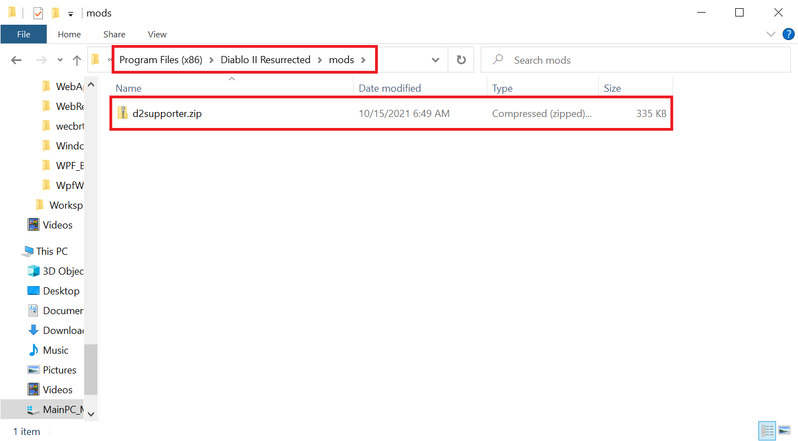
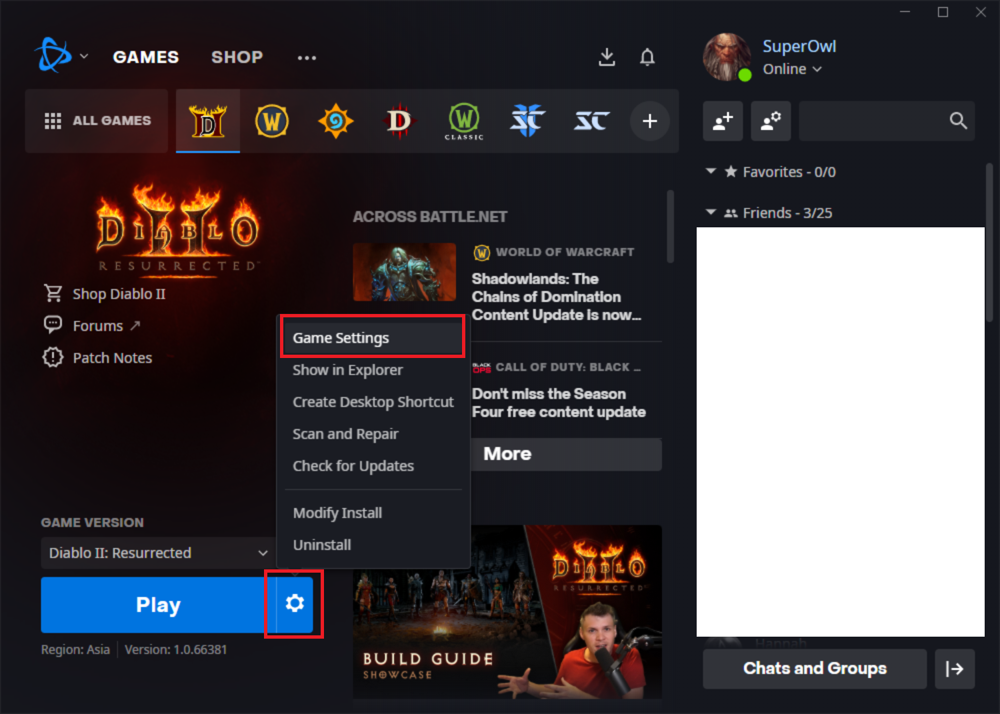

# Diablo 2 Resurrected Item Name Mod

For reference, this function is also allowed by Blizzard to support the Mod, and since it is a function that has been used for a long time, I do not think there is any problem with using it.
Both single player and multiplayer are supported.

##### However, use it at your own risk. I am not responsible if any problems arise.

## V 0.9.3
1. Add Korean
2. Bug fix

Click [here](https://kaki104.tistory.com/790) for Korean help. 

### V 0.9

1. Rune : (Number) + Color
2. HP5 : Red
3. MP5 : "Magic" Blue
4. Gold : G
5. FRP : Purple
6. Gems : "Crafted" Amber
7. Jewel, Charm : Red *
8. Items : [*] - No color applied

### How to apply 

1. Create a 'mods' folder under the Diablo 2 Resurrection folder. 

2. Download the [d2supporter.zip](https://github.com/kaki104/D2Supporter.Mod/blob/master/d2supporter.zip) file and move it to the 'mods' folder. 

3. Unzip it. 

4. Result

5. Launch the launcher and select the Game Settings menu from the Options menu. 

6. Check 'Additional...' and enter "-mod d2supporter -txt". 

7. Press done and run the game. If mod is applied, the gamma value adjustment work performed at the first execution will proceed. 

### d2supporter Windows Store app
https://d2supporter.tistory.com/
